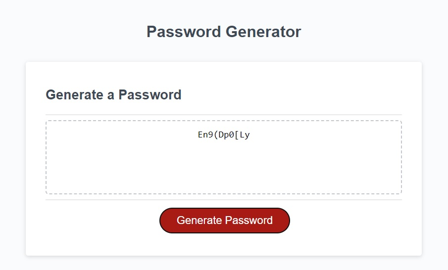

# Module 3 Challenge - Random Password Generator

## Description

Added functionality to the Random Password Generator interface to accept a password length, and character types specified by the user following a series of prompts and confirmations to the screen. After this, the user-input is validated for the password length and character types. This ensure that the password length is between 8 and 128 characters, as well as ensuring that the user selects at least one special character to be included in the password generation. If the input is invalid, the user will recieve alerts to the screen and will be asked to refresh the page and try again. Once the input is valid, the random password will be generated based off of the selected criteria and returned to the screen for use. 

Published website:  https://molyneauxk93.github.io/KevinMolyneaux-Random-Password-Generator/

## Installation

N/A

## Usage

Random password generator that enables employees to generate random passwords based on criteria that they’ve selected.

## Credits

Found resource that assisted me with generating random characterss: 

<a href="https://www.coderrocketfuel.com/article/generate-a-random-letter-from-the-alphabet-using-javascript">Generate a random letter from the alphabet using Javascript</a>

## License

MIT License - Please refer to the LICENSE in the repo.

## Usage
The following image shows the prompt to the user to specify the password length:

The follwing image shows the confirmation for whether or not the user would like to include UpperCase characters:

The follwing image shows the confirmation for whether or not the user would like to include LowerCase characters:

The follwing image shows the confirmation for whether or not the user would like to include Numeric characters:

The follwing image shows the confirmation for whether or not the user would like to include Special characters:

The following image shows the generated password displayed to the screen based on a given criteria: 

The following shows alert to user if specified character length is less than 8 or greater than 128 characters: 

The following shows alert to user if no character types are selected. At least one must be selected: 

 

The following shows the message returned to the textbox on the screen once an alert is acknowledged: 

 